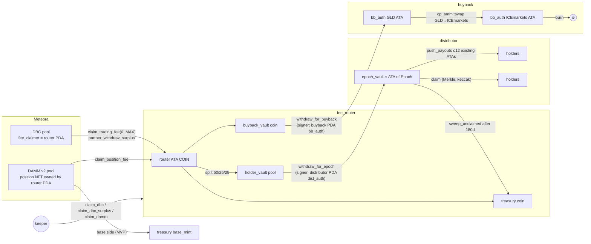

# Fee stack: `fee_router` → `distributor` / `buyback`

The contract is in [`docs/CONTRACTS.md`](../docs/CONTRACTS.md) §2–4. Background research is in `docs/research/02` and `05`.

**Trust model.** The router PDA signs Meteora CPIs, so those program ids are hard-checked (`address = DBC_PROGRAM_ID / DAMM_V2_PROGRAM_ID`). Every vault is a seed-derived PDA, and a claim splits only the delta it produced in the shared receiving ATA. Anyone can call `claim_dbc` and `claim_damm` once 900 s have passed since the last claim, because the funds can only reach fixed vaults. `withdraw_for_*` checks that the signer is `find_program_address([seed], cfg.<program>)`. The distributor funds epochs in one of two ways. In router mode, the prod path, it CPIs `withdraw_for_epoch`, and `source_authority` must be `PoolState[args.pool]`. In direct mode, used by tests and top-ups, the signer owns `source_vault`. `fee_claimer` can never be changed on a DBC config, so keep `fee_router` upgradeable behind Squads with a timelock.

**New seeds for the SDK** (not yet in `packages/registry` SEEDS): distributor `dist`, `dist_auth`; buyback `bb_auth`. The fee_router receiving account is `ATA(router PDA, COIN)`.

**Differences from CONTRACTS v0.1** (update the contract):
- `RouterConfig.peg_desk_program` takes 32 bytes of `_reserved`, so every earlier offset is unchanged.
- New instructions:
  - `register_pool_admin`
  - `withdraw_for_epoch` / `withdraw_for_buyback` / `withdraw_treasury`
  - `set_programs`
  - distributor `set_keepers` / `set_params`
- `record_migration` is keeper/admin only, to stop a junk position NFT being gifted to the router and recorded in front of the real one. It takes `force` (admin only) to skip the `is_migrated` byte check.
- `push_payouts` takes `Vec<PayoutItem{wallet, amount}>`, which is Borsh-identical to `Vec<(Pubkey,u64)>`.
- `convert_and_burn(amount, min_ice_out, gld_is_token_a)`. `reserve_buffer_bps` is read as "leave this share of buyback_vault untouched per cycle".
- Instruction modules are named `cpi_ext/`, not `cpi/`, because Anchor's `#[program]` generates a crate-root `cpi` module.

## VERIFY when network is available

Run `pnpm exec tsx scripts/print-discriminators.ts --check path/to/dbc.json path/to/cp_amm.json`. It checks our constants and prints each IDL's account list for side-by-side review. Then tick these off:

1. **Discriminators.** All of these are `sha256("global:<name>")[..8]` and are only correct if Meteora uses Anchor's default naming:
   - DBC: `claim_trading_fee`, `partner_withdraw_surplus`, `migrate_damm_v2`
   - cp-amm: `claim_position_fee`, `swap`
   - Account discriminators: `PoolConfig`, `VirtualPool`, `Pool`, `Position`
2. **Account orders** (`// VERIFY ORDER vs IDL`):
   - `fee_router/src/cpi_ext/dbc.rs`: `claim_trading_fee` has 12 accounts plus `event_authority, program`. `partner_withdraw_surplus` has 8 plus the same two.
   - `fee_router/src/cpi_ext/damm_v2.rs`: `claim_position_fee` has 13 plus 2.
   - `buyback/src/cpi_ext/mod.rs`: `swap` has 11 accounts, plus `referral_token_account`, which is optional and receives the program id for None, plus 2. Also confirm that `swap(SwapParameters{amount_in, minimum_amount_out})` still exists at a85c926 and hasn't been replaced by `swap2`, and that the ICE/GLD pool doesn't need the instructions sysvar (rate-limiter fee mode).
   - Check that both programs really use `#[event_cpi]` on these instructions (the trailing 2 accounts), and check the writable/signer flags. We mark DAMM `pool` writable defensively.
3. **Offsets** (`// VERIFY OFFSET`, in `fee_router/src/constants.rs`). All include the 8-byte discriminator:
   - PoolConfig: `quote_mint@8`, `fee_claimer@40`
   - VirtualPool: `config@72`, `creator@104`, `base_mint@136`, `is_migrated@305`
   - Position: `pool@8`, `nft_mint@40`

   Check them by decoding a devnet account with the SDK. If an offset is wrong, `register_pool` fails closed. `register_pool_admin` and `record_migration(force=true)` are the escape hatches.
4. **DAMM token order.** A DBC-migrated pool is assumed to have `token_a = base` and `token_b = COIN` (`claim_damm`).
5. **PDAs.** Confirm DBC `pool_authority`/`event_authority` and DAMM `pool_authority`/`event_authority`. They are passed through unchecked, and the callee validates them.
6. **Program ids.** `PegDesk1111…1111` in `Anchor.toml` decodes to **33 bytes**, so it is an invalid pubkey. Replace it before `peg_desk` builds. fee_router stores the peg_desk id in config for this reason.
7. **Typed CPI.** To switch, add `dynamic-bonding-curve` / `cp-amm` (`workspace = true`) to the program's Cargo.toml and replace the `cpi_ext::*` calls with `dynamic_bonding_curve::cpi::…` / `cp_amm::cpi::…`. There are notes in each Cargo.toml.
